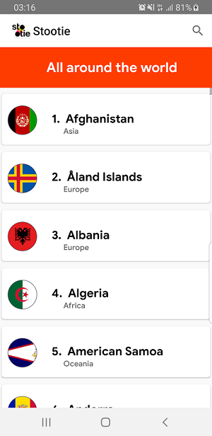
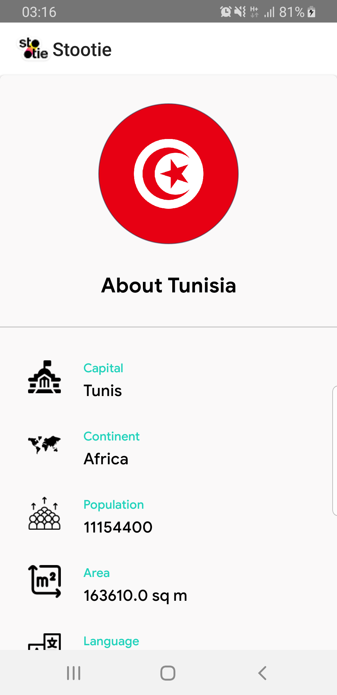

# Stootie App
> This is an android application for evaluation purpose only! It is mainly about displaying the whole world countries with search feature and showing each country's details and information.

## Table of contents
* [General info](#general-info)
* [Screenshots](#screenshots)
* [Technologies](#Technologies)
* [Setup](#Setup)
* [Features](#features)
* [Status](#Status)
* [Inspiration](#Inspiration)
* [Contact](#Contact)

## General info
This is an Android app that works on most of Android OS running terminals. It allows user to display the countries details and general information.

## Screenshots

## Technologies
* KOTLIN - version 1.0
* RxJava 2 - version 2.0
* Dagger2 - version 2.21
* GlideToVectorYou - version 2.0
* Retrofit - version 2.6.0
* JUnit - version 4.12
* Powermock - version 1.7.1
* Mockito - version 2.8.9
* Dagger2 - version 3.0
* Espresso - version 3.1.0-alpha4

## Setup
* Install Android Studio version 3+
* Install JDK and necessary SDKs versions
* Get project from version Control Github

## Code Examples
`  @Test
   fun `should init view`() {
     presenter.initialise()
     verify(view).initialiseView()
   }

   @Test
   fun `should dispose subscription`() {
     presenter.disposeSubscriptions()
     verify(getCountriesListUseCase).dispose()
   }

   @Test
   fun `should execute usecase when initialise is invoked`() {
     presenter.initialise()
     verify(getCountriesListUseCase).execute(any(CountriesListObserver::class.java), ArgumentMatchers.isNull())
   }

   @Test
   fun `should set articles list to view`() {
     val list = emptyList<Country>()
     presenter.showCountriesList(list)
     verify(view).showCountriesList(list)
   }
 }`

To-do list:
* improve Search feature
* implement paging feature when scrolling the countries list

## Status
Project is: Finished

## Inspiration
This app is inspired by the new Google UI/UX recommendations and best practices

## Contact
Created by Iheb SAHLOUL
           ihebsahloul@hotmail.fr/isahloul@gmail.com
           (Tunisia): (+216) 28 796 295
           (France):  (+33) 977 215 250
           https://www.linkedin.com/in/iheb-sahloul-6b2b41aa/